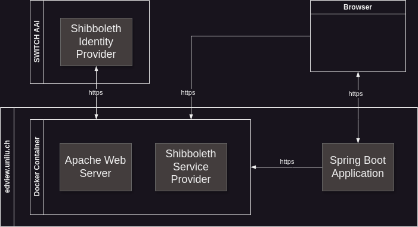

# Uni Luzern Prüfungsabfrage - PoC Login

## Overview



## Create & Run Service Provider

If not already done, you should set up your local Shibboleth Service Provider (SP). Therefore, clone the repository
and following the installation and configuration instructions:

```
git clone git@ssh.gitlab.puzzle.ch:cga/docker/unilu-docker-shibboleth-sp.git
```

## Setup SSL for PoC Application

For simplicity, we use the same certificate and key as the Apache httpd server uses. This might be changed when
implementing the real EFT application.

1. `cd src/main/resources/certs/prod`
2. Copy the content of httpd certificate and private key to files `resources/prod/httpd.crt.pem` and
   `resources/prod/httpd.key.pem`.
3. Create the local keystore for SSL:
   `openssl pkcs12 -export -in httpd.crt.pem -inkey httpd.key.pem -name unilu-eft -out httpd.keystore.p12`
   (password see application.yml).
4. Do the similar steps for test environment in `src/main/resources/certs/test` to copy and create the files
   `httpd.crt`, `httpd.key.pem`, and `http.test.keystore.p12`.
5. Check and/or adapt configuration in `application.yml` or `application-test.yml`, e.g.

         server:
           address: edview.unilu.ch
           port: 8443
           forward-headers-strategy: framework
           ssl:
             key-store-type: PKCS12
             key-store: classpath:certs/prod/httpd.keystore.p12
             key-store-password: <see application.xml>
             key-alias: unilu-eft
             client-auth: want

6. Start `PoC Login (TEST)` or `PoC Login (PROD)` run configuration to see Tomcat initialization on port 8443 (HTTPS)
7. Enter [https://edview-test.unilu.ch:8443](https://edview-test.unilu.ch:8443)
   or [https://edview.unilu.ch:8443](https://edview.unilu.ch:8443) in your web browser to start the web
   application.

The alias `edview.unilu.ch` is used for the application host (localhost). Therefore, you might add the alias to
`/etc/hosts` if not already done. The same is true for test environment `edview-test.unilu.ch`.

## Docker

### Build Image

`docker build . -t uni-luzern`

### Run Image

`docker run --rm  -v ./static:/resources -p 8080:8080 uni-luzern:latest`
