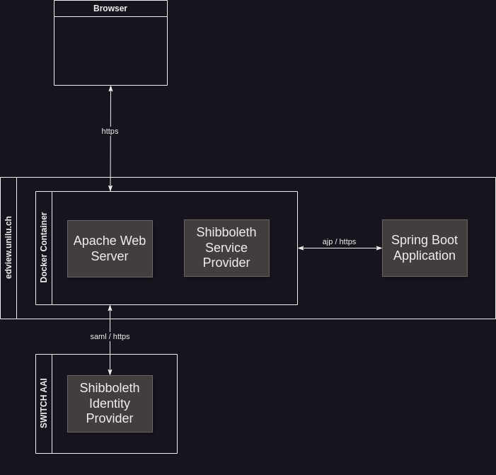

# Shibboleth SP with Apache httpd
To secure the Exam Feedback Tool (EFT) [SwitchAAI](https://help.switch.ch/aai/) is used, which in turn is built on [Shibboleth](https://help.switch.ch/aai/about/shibboleth/).
For this a reverse proxy, that acts as a Shibboleth Service Provider (SP), is needed. In our case that will be Apache. The EFT application is behind the Apache server
running in a Spring Boot environment. And finally, Spring Boot uses a Tomcat Server with specific connectors for HTTPS and AJP (Apache Java Protocol).

## Create & Run Docker Image Locally
Preparation:

Provided certificates can be downloaded [here](https://files.puzzle.ch/apps/files/files/7229088?dir=/Styles%20Uni%20Luzern/Certificates). For instructions where to place files or how to generate them read
the [Generate New Certificates](#generate-new-certificates) section.

1. Copy the provided httpd certificate and key to the test or prod dir or generate them. For local development it's easiest to
use self signed certificates.
2. Copy the provided sp certificate and key to the test or prod dir. It is also possible to generate them but we currently
need to use the provided ones.
3. Download the `SWITCHaaiRootCA.crt.pem` and place it in the `/secrets` dir (not in the prod or test dir!). This file cannot
be generated.
4. Generate the keystore for the httpd certificate and key by going into the test or prod dir and then using the correct command:
   - Prod: `openssl pkcs12 -export -in httpd.crt.pem -inkey httpd.key.pem -name unilu-eft -out httpd.keystore.p12`. Choose a good password
   and remember it, as you will need it to run the application.
   - Test: `openssl pkcs12 -export -in httpd.crt.pem -inkey httpd.key.pem -name unilu-eft-test -out httpd.test.keystore.p12`. Here you need to use the
   password in the application-test.yml.
5. Add aliases for `edview.unilu.ch` and `edview-test.unilu.ch` to your [host file](https://linuxhandbook.com/etc-hosts-file/).

There are two docker compose files to run the application. The `docker-compose.yml` file is the dev config which uses the secrets
in `/shibboleth/secrets/test`. This config rebuilds the service provider image every time and the application is started with a maven command within the container.

The following env variables are available for the dev config:

| Variable          | Description                               | Default value | Mandatory |
|-------------------|-------------------------------------------|---------------|-----------|
| SB_PROFILE        | The Spring Boot profile that will be used | dev           | No        |

To run this config, run the following command in the root directory of the project:

`docker compose up --build --force-recreate`

The `docker-compose-prod.yml` file is used for the prod environment. It fetches the docker images for the application and the service provider
with the provided tag from the GitHub image registry and runs them with the secrets in `/shibboleth/secrets/prod`

The following env variables are available for the prod config:

| Variable          | Description                                                                                               | Default value           | Mandatory |
|-------------------|-----------------------------------------------------------------------------------------------------------|-------------------------|-----------|
| TAG               | The tag of the application and service provider image that should be used                                 | -                       | Yes       |
| RESOURCE_LOCATION | Path to the directory containing the subject directories with the exams in them                           | -                       | Yes       |
| KS_PW             | The password which was while generating the keystore                                                      | -                       | Yes       |
| KS_TYPE           | Tells the application what type of keystore is used                                                       | PKCS12                  | No        |
| KS_NAME           | The full name including file extension of the keystore                                                    | httpd.keystore.p12      | No        |
| KEY_ALIAS         | Sets the alias that identifies the key in the keystore                                                    | unilu-eft               | No        |
| SEC_LOCATION      | The location where certificates, keys and keystore are stored. Value relative to prod docker compose file | shibboleth/secrets/prod | No        |

To run this config execute the following command:

`RESOURCE_LOCATION=<resource-path> KS_PW=<keystore-password> TAG=<image-tag> docker compose -f docker-compose-prod.yml up --build --force-recreate`

When you start a session within the docker image you can find the metadata file from `AAI Test` or `SWITCH AAI` under
`/var/cache/shibboleth/` which will be refreshed every hour.

## Generate New Certificates

| Environment | Default secret location  |
|-------------|--------------------------|
| Prod        | /shibboleth/secrets/prod |
| Test        | /shibboleth/secrets/test |

The following steps can be done for `test` and / or `prod` environment. The commands allow the parameter `test` or
`prod`, which will generate the certificates in `/shibboleth/secrets/test` or `/shibboleth/secrets/prod` accordingly.
The default environment is `test`.

1. Create the host certificate for Apache HTTP/S server using the command `httpd-certificate`. The configuration is
   defined in `httpd.crt.conf`. The result is the public certificate `httpd.crt` and its private key file
   `httpd.key.pem`.
2. Create the Shibboleth Service Provider certificate using the command `sp-certificate`. The configuration is defined
   in `sp.crt.conf`. The result is the public certificate `sp.crt.pem` and its private key file `sp.key.pem`. Attention:
we currently use the provided certificates for the sp.

To use the self-signed host certificate created in step 1 you should add this certificate to the Java trust store using
the following commands for test or prod environment:

    keytool -importcert -trustcacerts -file resources/prod/httpd.crt.pem -alias unilu-httpd -cacerts
    keytool -importcert -trustcacerts -file resources/test/httpd.crt.pem -alias unilu-httpd-test -cacerts

## Commands

| Command                                                                                                                                           | Parameter                                                                                     | Description                                            |                                        
|---------------------------------------------------------------------------------------------------------------------------------------------------|-----------------------------------------------------------------------------------------------|--------------------------------------------------------|
| docker compose up --build --force-recreate                                                                                                        | -                                                                                             | Start the dev environment                              |
| RESOURCE_LOCATION=<resource-path> KS_PW=<keystore-password> TAG=<image-tag> docker compose -f docker-compose-prod.yml up --build --force-recreate | See [this](#create--run-docker-image-locally) section for further configuration with env-vars | Start the prod environment                             |
| httpd-certificate                                                                                                                                 | [test \| prod] (default: test)                                                                | Create the Apache HTTP/S server certificate            |
| sp-certificate                                                                                                                                    | [test \| prod] (default: test)                                                                | Create the Shibboleth Service Provider certificate     |
| openssl pkcs12 -export -in httpd.crt.pem -inkey httpd.key.pem -name unilu-eft -out httpd.keystore.p12                                             | -                                                                                             | Generate the prod keystore with the httpd cert and key |
| openssl pkcs12 -export -in httpd.crt.pem -inkey httpd.key.pem -name unilu-eft-test -out httpd.test.keystore.p12                                   | -                                                                                             | Generate the test keystore with the httpd cert and key |

## Mandatory Files
The following files are mandatory and need to be supplied via the volume mounts specified in the `docker-compose.yml` file.
You can download all the necessary files from [here](https://files.puzzle.ch/apps/files/files/7229088?dir=/Styles%20Uni%20Luzern/Certificates) or generate them as described [here](#create--run-docker-image-locally).

| Name                                       | Target Dir in container     | Additional Information                                                                                 |                                        
|--------------------------------------------|-----------------------------|--------------------------------------------------------------------------------------------------------|
| sp.crt.pem                                 | /etc/shibboleth             | Can be downloaded (preferred) or generated                                                             |
| sp.key.pem                                 | /etc/shibboleth             | Can be downloaded (preferred) or generated                                                             |
| SWITCHaaiRootCA.crt.pem                    | /etc/shibboleth             | **Cannot be generated**, needs to be downloaded from the link above                                    |
| httpd.crt.pem                              | /etc/pki/tls/certs          | Can be downloaded (preferred) or generated                                                             |
| httpd.key.pem                              | /etc/pki/tls/private        | Can be downloaded (preferred) or generated                                                             |
| httpd.keystore.p12/httpd.test.keystore.p12 | /secrets/httpd.keystore.p12 | Needs to be generated. For further instructions read [this](#create--run-docker-image-locally) section |

## Useful Links

### Tests for TEST environment

- Test link: https://edview-test.unilu.ch/Shibboleth.sso/Session (HTTP Status 200 and message "A valid session was not
  found." expected)
- Status link: https://edview-test.unilu.ch/Shibboleth.sso/Status (HTTP Status 200 and StatusHandler XML document
  expected)
- Login: https://edview-test.unilu.ch/Shibboleth.sso/Login (processing login on AAI Test)
- Logout: https://edview-test.unilu.ch/Shibboleth.sso/Logout (logout from AAI Test)
- Metadata link: https://edview-test.unilu.ch/Shibboleth.sso/Metadata (download Metadata file expected)

### Tests for PROD environment

- Test link: https://edview.unilu.ch/Shibboleth.sso/Session (HTTP Status 200 and message "A valid session was not
  found." expected)
- Status link: https://edview.unilu.ch/Shibboleth.sso/Status (HTTP Status 200 and StatusHandler XML document
  expected)
- Login: https://edview.unilu.ch/Shibboleth.sso/Login (processing login on SWITCH AAI)
- Logout: https://edview.unilu.ch/Shibboleth.sso/Logout (logout from SWITCH AAI)
- Metadata link: https://edview.unilu.ch/Shibboleth.sso/Metadata (download Metadata file expected)

### Apache and SSL

- How to install Apache on Rocky Linux 9: https://www.linuxteck.com/how-to-install-apache-on-rocky-linux/
- mod_ssl on Rocky Linux: https://docs.rockylinux.org/guides/web/mod_SSL_apache/

### Shibboleth Service Provider

- Shibboleth Service Provider: https://shibboleth.atlassian.net/wiki/spaces/SP3/overview?homepageId=2058387896
- Shibboleth RPMs: https://shibboleth.net/downloads/service-provider/RPMS/
- Create an Embedded Certificate: https://help.switch.ch/aai/guides/sp/embedded-certificate/
- JavaHowTo (Shibboleth 3): https://shibboleth.atlassian.net/wiki/spaces/SP3/pages/2067400159/JavaHowTo

### Create Certificate

- Creating a Host Certificate: https://node-security.com/posts/openssl-creating-a-host-certificate/
- Create your own CA: https://arminreiter.com/2022/01/create-your-own-certificate-authority-ca-using-openssl/
- Create CA cert and key: https://www.apachelounge.com/viewtopic.php?t=8891